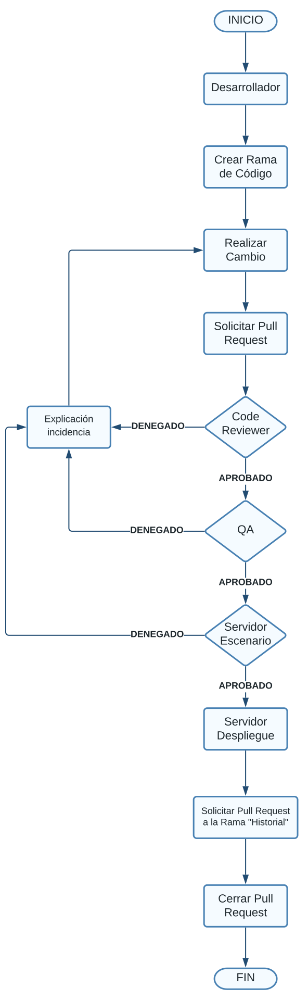

# Proceso de implementación

El proceso de revisión de cambios y solicitudes de pull será fundamental para asegurar y garantizar la integridad del código. Aquí se describen los pasos principales y los roles involucrados en este proceso.

## Desarrolladores:

Los desarrolladores son responsables de escribir y actualizar el código en el repositorio de GitHub. Cuando un desarrollador desea agregar una nueva funcionalidad o hacer una corrección de errores, primero debe crear una nueva rama de código a partir de la rama principal. Luego, en la nueva rama, el desarrollador hace los cambios necesarios y envía una solicitud de pull (pull request) a la rama principal del repositorio.

Para asegurar la calidad e integridad del desarrollo, el equipo de desarrolladores fue segmentado y desplegado en distintos roles los cuales cuentan con alcances referentes a su estatus.

- Desarrolladores Junior:
    - Becarios
- Desarrolladores Semi Senior:
    
    <aside>
    💡 Al momento que los desarrolladores trabajen en un módulo deberán de seguir las siguiente reglas:
    
    1. El nombre de la rama será igual al módulo sobre el cual se desarrollará.
    2. Deberá versionar el módulo utilizando los [commits convencionales](https://www.conventionalcommits.org/es/v1.0.0-beta.2/)
    </aside>
    
    - [Guzmán Pérez Johan](https://github.com/JohanKrauss)
    - [Vazquez Vizcarra Lizbeth Johana](https://github.com/jl-yhun)
- Desarrolladores Senior:
    - [Torres Servin Emmanuel](https://github.com/Byteshot)

## Code reviewers:

Los code reviewers son los encargados de revisar y evaluar los cambios propuestos en una solicitud de pull. Un code reviewer debe tener conocimiento técnico en el área específica del proyecto para poder entender y evaluar adecuadamente los cambios propuestos. El code reviewer puede hacer comentarios, sugerencias y solicitar cambios adicionales para asegurarse de que el código esté correctamente escrito y de que cumpla con los estándares de calidad y seguridad del proyecto.

## QA:

Una vez que los cambios han sido revisados por el code reviewer, el siguiente paso es pasarlos por un proceso de aseguramiento de calidad (QA). El QA es un proceso de verificación de la funcionalidad y calidad del código propuesto para asegurarse de que cumple con los requisitos del proyecto. El QA puede incluir pruebas de funcionalidad, pruebas de carga, pruebas de seguridad y otras pruebas necesarias para validar el código.

## Servidor escenario:

Una vez que el código ha pasado satisfactoriamente las pruebas de QA, se envía a un servidor de escenario (staging server). En este servidor, el código es evaluado en un ambiente de producción simulado para verificar que todo funciona correctamente. Los errores que se detecten aquí se deben corregir antes de pasar al siguiente paso.

## Servidor de despliegue:

Finalmente, el código es desplegado en el servidor de producción. En este paso, el código ya ha sido revisado por el code reviewer, probado por el equipo de QA y evaluado en el servidor de escenario, por lo que se espera que el despliegue se realice sin problemas. Una vez que el código ha sido desplegado en producción, el desarrollador responsable puede cerrar el pull request.

## Diagrama de proceso

